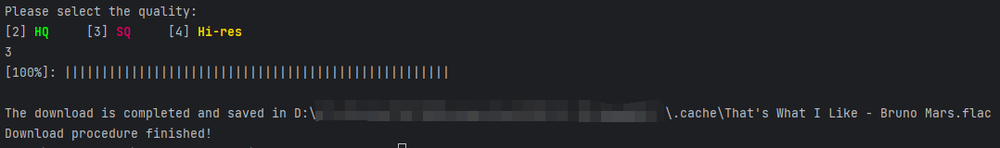

# MegaMDL - Enjoy online music in console

[](https://github.com/SnapdragonLee/MegaMDL/releases/latest) [](./LICENSE)

[TOC]

## Support & Features


- [x] Online music searching

- [x] Music download with different quality: `Low Quality(LQ)`，`High Quality(HQ)`, `Super Quality(SQ)`, `Hi-res Quality(Hi-res)`

  | Quality | Parameter            | Format  |
  | ------- | -------------------- | ------- |
  | LQ      | 128kbps              | MP3     |
  | HQ      | 320kbps              | MP3/OGG |
  | SQ      | 16bit 44.1kHz        | FLAC    |
  | Hi-res  | 24bit 44.1/96/192kHz | FLAC    |

  

- [x] Support multithreaded to accelerate estimation on all resources in different service

- [x] Algorithm to analyze quality of audio

- [x] Metadata included

- [x] Exception judgement precisely

- [x] Server-closed detection

- [x] Fix plenty of bugs about format in console

- [ ] Metadata fix with info from other sources

- [ ] Add support for other audio origin services

- [ ] Other


***This repo contains lots of bugs, and it's still a semi-finished product. If anything you wanna help me, send me request or contact with me.***


## Usage

1. Install all dependencies from `requirements.txt` using pip:

   ```bash
   pip install ./requirements.txt
   ```

2. Modify the config file located in `config/conifg.json`. There would be 3 options to set up:

   `save_dir` : Music download directory

   `default_mod` : 

   | Mod  | Name                 | Properties                                           |
   | ---- | -------------------- | ---------------------------------------------------- |
   | 1    | Main                 | All qualities can be downloaded                      |
   | 2    | Backup               | Only LQ and Hi-res can be downloaded                 |
   | 5    | Slow Hi-Res Download | Only HQ, SQ, or Hi-res(Sometimes signed by mistakes) |

   `p3_320k_format` : This could be filled by "mp3" or "ogg".

   

3. Start it with python 3.6 or above:

   ```bash
   python ./main.py
   ```

4. Server detection or started by `default_mod` first, there would be 3 modes: `Main`，`Backup`,  `Slow Hi-Res Download` .

5. Search songs by typing words:

   

6. Type the option number and select download type which you prefer:

   

   *Please wait until the procedure finished. If your network traffic is slow and choose `SQ` or `Hi-res` option, **this may take a few minutes to work out.**

7. Now enjoy your onw music with fully metadata loaded:

   

> ###### *Due to server issues and judge incorrect, you may stuck at some time. Be free to wait a while or `Ctrl+C` to break the program and try it again!


## License

Apache 2.0


## Chinese left

这下终于摆脱QQ、网易音乐的各种版本解码问题了，闲暇的时间可以试试下一下歌曲，老便捷了。


## Logs

| Date      | Actions                                                                     |
|-----------|-----------------------------------------------------------------------------|
| 2023.10.6 | v0.96-Beta is released                                                      |
| 2023.9.28 | Fix bugs in download procedure                                              |
| 2023.9.28 | v0.95-Beta is released                                                      |
| 2023.9.28 | Add colors in console to emphasize different quality from different sources |
| 2023.9.27 | Fix "Different modes may cause plenty of request exceptions" issues         |
| 2023.9.27 | Download procedure multi-threading finished, but got no exception judgments |
| 2023.9.25 | Initial project                                                             |

